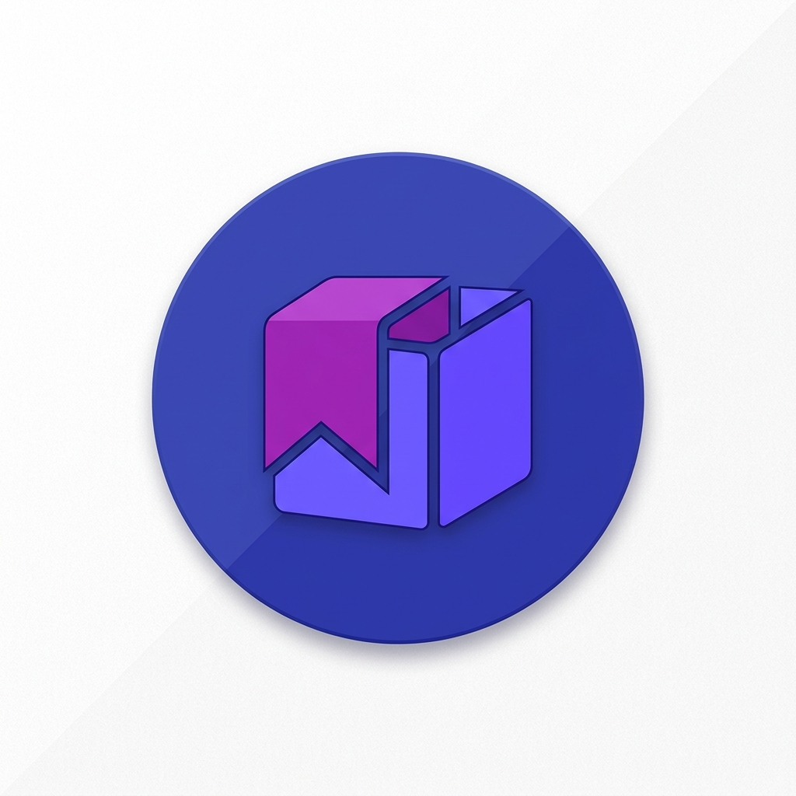

# Stash



**Stash** is a smart, cloud-synced link-saving application built with Flutter. It aims to streamline your process of saving, categorizing, and retrieving links on the go.

It utilizes Firebase for authentication and database synchronization (with full offline support) and natively integrates with Android's share intents to allow you to easily save links from any browser or application.

---

## 1. Local Development

Follow these steps to get the app running locally in minutes.

### Prerequisites

- [Flutter SDK](https://flutter.dev/docs/get-started/install) (`>=3.10.0`)
- Android Studio / Android SDK (for Android compilation)
- A Firebase project set up for this application.

### Setup Instructions

1. **Clone the repository**

   ```bash
   git clone https://github.com/XploitMonk0x01/stash
   cd stash
   ```

2. **Install Flutter Dependencies**

   ```bash
   flutter pub get
   ```

3. **Configure Firebase (Secrets & Keys)**
   This app requires a Firebase project with Authentication (Email/Password & Google) and Cloud Firestore enabled.
   - Run `flutterfire configure` to generate the `lib/firebase_options.dart` file.
   - For Android, download the `google-services.json` file from your Firebase console and place it in the `android/app/` directory.

4. **Run the Application**
   ```bash
   flutter run
   ```

---

## 2. Understanding the System

### Core Architecture

This project follows a feature-driven folder structure, utilizing **Riverpod** for robust state management and **GoRouter** for declarative routing.

```
lib/
├── core/                  # App-wide utilities, theme, and routing logic
│   ├── router/            # GoRouter configuration (`app_router.dart`)
│   ├── theme/             # Material 3 themes & Riverpod theme provider
│   └── utils/             # Share handler, metadata fetchers, formatting
├── features/              # Feature-bound domain logic
│   ├── auth/              # Firebase email/password & Google Sign-In
│   ├── categories/        # Link categorization & filtering logic
│   └── links/             # Core link saving, metadata resolution, UI
├── firebase_options.dart  # Firebase generated config
└── main.dart              # Entry point & global initializations
```

### Key Technologies

- **UI & Animations:** Material 3, `google_fonts`, `shimmer` (for loading skeletons), `flutter_animate` (for entry/exit animations).
- **State Management:** `flutter_riverpod` (v2.6+) ensures decoupled architectures and responsive provider listeners.
- **Routing:** `go_router` handles deep links and internal path-based navigation.
- **Backend (Firebase):**
  - **Firestore** handles all storage needs. It is aggressively configured for offline-first usage (`persistenceEnabled: true` and `CACHE_SIZE_UNLIMITED`).
  - **Firebase Auth** is configured alongside `google_sign_in_android` for seamless access.

### Native Integration: Share Intent

The application listens to the OS-level share actions using `share_handler`.
When a user shares a URL from YouTube, Chrome, or Twitter into Stash:

1. `ShareIntentHandler().init()` binds OS-level broadcast receivers.
2. `StashApp` listens to `ShareIntentHandler().sharedUrl`.
3. If a link is received, the Add Link Bottom Sheet (`AddLinkSheet`) is immediately invoked, auto-populating the URL.

---

## 3. Production Deployment

### Firestore Rules

Ensure your Firestore rules strictly lock down user data. Because the app utilizes user collections, your rules (`firestore.rules`) should resemble:

```javascript
rules_version = '2';
service cloud.firestore {
  match /databases/{database}/documents {
    match /users/{userId}/{document=**} {
      allow read, write: if request.auth != null && request.auth.uid == userId;
    }
  }
}
```

### Deploying for Android (Play Store)

1. **Keystore Configuration**
   Ensure your Android production keystore `.jks` file is generated and referenced properly in `android/key.properties`.

2. **Update App Icon & Name**
   If you change the icon, regenerate native assets using:

   ```bash
   flutter pub run flutter_launcher_icons
   ```

3. **Build AppBundle**
   Run the following command to generate an optimized AAB for the Google Play Store:

   ```bash
   flutter build appbundle --release
   ```

4. **Firebase Production Environment**
   Ensure your release SHA-1 and SHA-256 fingerprint certificates are added to the Firebase Console so Google Sign-In and AppCheck (if enabled) function properly in the release build.

- **Android share intents**: `share_handler`
- **Metadata scraping**: `metadata_fetch`

## Supported Platforms

- **Android**: supported
- **iOS / Web / Desktop**: not configured (Firebase options are Android-only)

## Project Structure

High-level layout (most code lives under `lib/`):

- `lib/main.dart` — app entry, Firebase init, offline persistence, share-intent listener
- `lib/core/` — routing, theme, and shared utilities
- `lib/features/auth/` — sign-in/up, profile, and auth repository
- `lib/features/links/` — link list/home UI, add link sheet, link repository
- `lib/features/categories/` — categories UI and repository

## Data Model (Firestore)

All data is scoped per authenticated user.

### Paths

- `users/{uid}` — user profile document
- `users/{uid}/links/{linkId}` — saved links
- `users/{uid}/categories/{categoryId}` — categories

### `users/{uid}` fields

| Field        | Type         | Notes                           |
| ------------ | ------------ | ------------------------------- |
| `name`       | string       | Display name                    |
| `email`      | string       | Email                           |
| `photo_url`  | string\|null | From Firebase user              |
| `created_at` | timestamp    | Stored as Firestore `Timestamp` |

### `users/{uid}/links/{linkId}` fields

| Field          | Type      | Notes                                |
| -------------- | --------- | ------------------------------------ |
| `url`          | string    | Must be `http(s)`                    |
| `label`        | string    | User-provided label                  |
| `category`     | string    | Category name (e.g. `Other`)         |
| `favicon_url`  | string    | From metadata / fallback favicon URL |
| `page_title`   | string    | From metadata                        |
| `created_at`   | timestamp | Stored as Firestore `Timestamp`      |
| `is_favourite` | bool      | Favourite toggle                     |

### `users/{uid}/categories/{categoryId}` fields

| Field         | Type      | Notes                                       |
| ------------- | --------- | ------------------------------------------- |
| `name`        | string    | Category name                               |
| `color_index` | number    | Palette index                               |
| `is_default`  | bool      | Reserved for default categories             |
| `created_at`  | timestamp | `FieldValue.serverTimestamp()` when created |

## Getting Started (Local Development)

### Prerequisites

- Flutter SDK installed and working (`flutter doctor` should be clean)
- Android Studio (or Android SDK + emulator/device)
- A Firebase project (see below)

### Install Dependencies

```bash
flutter pub get
```

### Firebase Setup

This app uses:

- Firebase Auth (Email/Password + Google)
- Cloud Firestore

1. **Create a Firebase project** in the Firebase Console.

2. **Add an Android app** to the Firebase project:

- Package name: `com.master.stash` (see `android/app/build.gradle.kts`)

3. **Download** `google-services.json` and place it at:

```
android/app/google-services.json
```

4. **Generate `firebase_options.dart`** (recommended):

If you’re setting this up for your own Firebase project, use FlutterFire CLI:

```bash
dart pub global activate flutterfire_cli
flutterfire configure
```

5. **Enable Firestore rules** (see the next section).

### Firestore Security Rules

The repo includes rules in `firestore.rules` that allow each user to access only their own profile document and subcollections.

If you can log in but see `cloud_firestore/permission-denied`, you likely need to publish the rules.

Paste the contents of `firestore.rules` into:

Firebase Console → Firestore Database → Rules

Note: If you add new user subcollections beyond `links` and `categories`, update the rules accordingly.

### Run the App

```bash
flutter run
```

## Common Tasks

### Run Tests

```bash
flutter test
```

### Build a Release APK (Local)

This project currently uses the debug signing config for `release` builds. For real releases, set up your own keystore and update the signing config in `android/app/build.gradle.kts`.

```bash
flutter build apk --release
```

## Troubleshooting

### Firestore `permission-denied`

- Ensure you’re signed in.
- Ensure Firestore rules are published (see `firestore.rules`).
- Ensure your data lives under `users/{uid}/...`.

### Firestore “requires an index” errors

Some filtered queries can require composite indexes. The link stream intentionally fetches all links and filters client-side to avoid index setup, but other queries may still trigger index requirements. If you hit index errors, follow the Firebase Console link in the error message to create the index.

### Share-to-Stash not triggering

- Confirm you’re testing on **Android**.
- Share a plain-text URL from a browser/app.
- Stash should open and show the “Add link” bottom sheet.

## License

Private project (no license specified).
